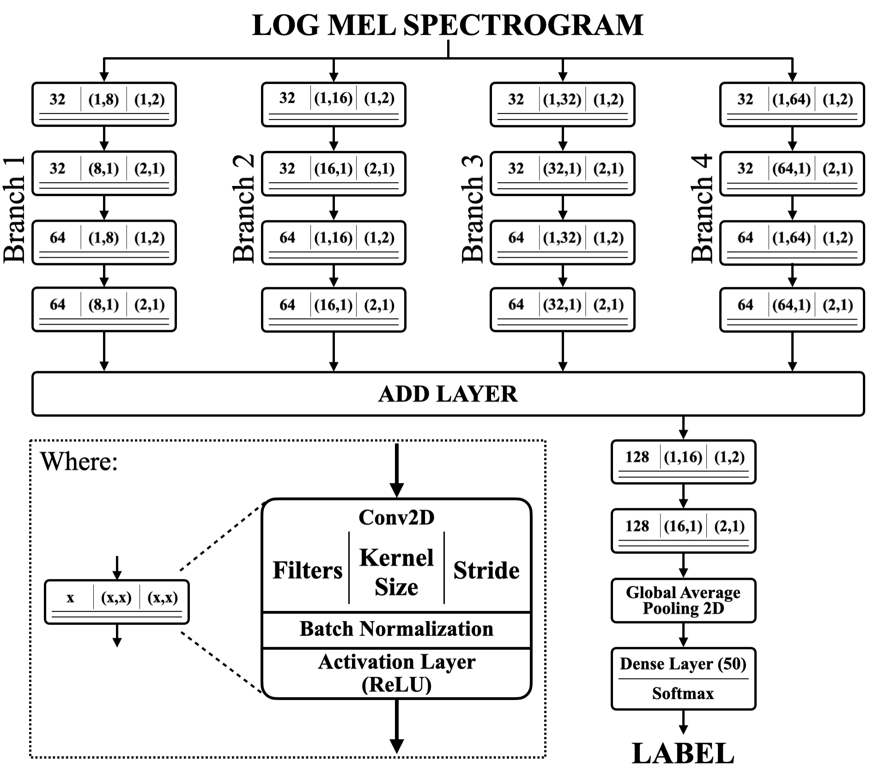

# Sound Event Classification
Sound Event Classification (SEC) has become an important task in the field of audio processing, with applications ranging from environmental monitoring to human-computer interaction. Aim of this project is to develop a sound event classification system based on a Convolutional Neural Network (CNN) architecture training it on the ESC-50 dataset. The model proposed is a multi-branch convolutional neural network (MBCNN) architecture that processes the log mel-spectrogram of the audio signal. It achieves an average test accuracy of 86%.

## Group:

- ####  Chiara Auriemma &nbsp;([@ChiaraAuriemma](https://github.com/ChiaraAuriemma))  10722613 &nbsp;&nbsp; chiara.auriemma@mail.polimi.it

- ####  Francesca Benesso &nbsp;([@fr-bn](https://github.com/fr-bn))  10700542 &nbsp;&nbsp; francesca1.benesso@mail.polimi.it

- ####  Anna Fusari &nbsp;([@AnnaFusari](https://github.com/AnnaFusari))  10561236 &nbsp;&nbsp; anna.fusari@mail.polimi.it

- ####  Filippo Marri &nbsp;([@filippomarri](https://github.com/filippomarri))  10110508 &nbsp;&nbsp; filippo.marri@mail.polimi.it

## 1. Problem Definition

This repository contains a Jupyter Notebook developed for an university project on sound event classification.
Aim of the project is the one to develop, train and analyse a model able to classify sound events given as input.

The training, validation and test set are partitions of the  [ESC50](https://github.com/karoldvl/ESC-50#esc-50-dataset-for-environmental-sound-classification) dataset.

### Jupyter environment
Python 3.9.9 has been used to run notebook.
Tensorflow 2.16.2 is used for the machine learning part. Additionally, following libraries were also installed for some specific audio-processing tasks:

* Librosa 0.10.2.post1
* Scikit-learn 1.6.1
* Audiomentations 0.41.0
* Pedalboard 0.9.17

## 2. Audio data selection and augmentationn

Some useful information are already provided by the dataset, i.e. each file is in mono format, has a duration of 5s, sampling rate of 44,100Hz, and in a 16 bit format. The dataset contains 2000 audio samples, 40 per each of the 50 classes.  To increase the performance of the model, a data augmentation has been performed with this functions:

-	Add different background noises with different SNRs
-	Pitch shifting
-	Time stretching
-	Dynamic range compression
-	Convolution with impulse responses

A single original file will therefore generate 5 new audio files for the training set that are added to the class of the original audio.

## 3. Features extraction
The log Mel-spectrogram is successfully used in classification. This is the feature we favor for our discussion.

## 4. Classifier Architecture
The model proposed is a multi-branch convolutional
neural network (MBCNN) architecture that processes the
log mel-spectrogram of the audio signal whose structure is reported below.

## 5. Jupyter Notebook

>[MBCNN](MBCNN.ipynb)

## 6. Summary
The model achieves an average test accuracy of 86%.